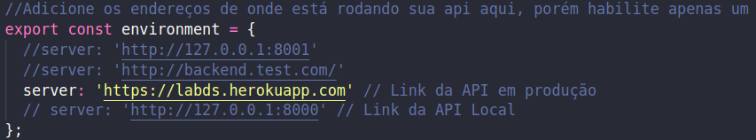

# Matemática

# Frontend

## Requisitos

[Composer][node]

[Ionic CLI][ionic]

[node]: https://nodejs.org/en/
[ionic]: https://ionicframework.com/docs/cli

## Manual de Utilização

1. Você deve clonar este repositório. Exemplo:

```
git clone git@gitlab.com:lucaswilliameufrasio/matematica-lds-frontend.git nomePasta
```

2. Depois navegar até a pasta do Frontend com o seguinte comando no terminal

```
cd nomePasta/Frontend
```

3. Instalar as dependências

```
npm i
```

4. Instalar o Ionic CLI

```
npm i -g ionic
```

5. Mudar a indicação de endereço da API no Frontend

   1.5. Navegue até src/environment/

   2.5. Tire o comentário dessa linha se deseja utilizar a API local

   

   3.5. Tire o comentário dessa linha se deseja utilizar a API em produção

   

6. Rode a aplicação

```
ionic serve
```

# Backend

## Requisitos

[Composer][composer]

[PHP 7.3][php]

[PostgreSQL 11][pgsql]

[Insomnia][insomnia]

[composer]: https://getcomposer.org
[php]: https://www.php.net/
[pgsql]: https://www.postgresql.org/download/
[insomnia]: https://insomnia.rest/download/

## Manual de Utilização

1. Abra um novo terminal e depois navegue até a pasta do Backend com o seguinte comando no terminal

```
cd nomePasta/Backend/
```

2. Criar uma cópia do arquivo .env

```
cp .env.example .env
```

3. Fornecer dados para as seguintes variáveis do arquivo .env

1.3. Nome da base de dados que você criou no PostgreSQL
   
```
DB_DATABASE
```

2.3. Nome de usuário com permissão de escrita e leitura da base de dados criada
   
```
DB_USERNAME
```

3.3. Senha do usuário
   
```
DB_PASSWORD
```

1. Instalar as dependências do Composer

```
composer install
```

5. Gerar as tabelas do banco de dados e popular com os dados iniciais e operações

```
php artisan migrate:refresh --seed
```

6. Gerar uma chave criptografica para o método de autenticação

```
 php artisan jwt:secret
```

7. Gerar uma chave criptografica da aplicação
```
php artisan key:generate
```

8. Rodar a aplicação

```
php artisan serve --port 8000
```

9. **Co-co-co-combo breaker** Para testar as rotas da API, baixe o Insomnia e faça a importação dos espaços de trabalho (Workspace)

    1. Clique no botão de dropdown próximo ao nome Insomnia
    2. Clique em "Import/Export"
    3. Clique em "Import Data", depois em "From file"
    4. Navegue até a pasta raiz deste projeto e selecione o arquivo "matematica_insomnia.json"
    5. Execute os passos anteriores e selecione o arquivo "matematicaheroku_insomnia.json"